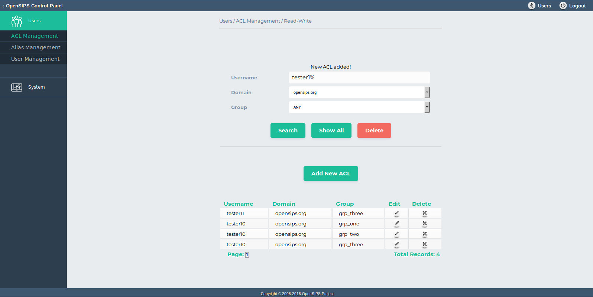

## Description

This tool allows ACLs/groupt provisioning for the SIP users (from the subscriber table). This tool maps over the *group* module from OpenSIPS.

You can search by username, domain and group, or show all records. In terms of operations, you assign or un-assign a SIP user to one or multiple groups.

## Configuration

- Database layer configuration file : **opensips-cp/config/tools/users/acl\_management/db.inc.php** Attributes set in this file :
  - database host
  - database port
  - database username
  - database password
  - database name
- Local configuration file : **opensips-cp/config/tools/users/acp\_management/local.inc.php** Attributes set in this file :
  1. Attributes like variables which control the way the tool displays information from database.
    ```
    // Sets number of results listed on a page
    $config->results_per_page = 10;
    //Sets number of pages per range	
    $config->results_page_range = 10;
    ```
  2. The name of the DB table where the groups (and mapping to SIP users) are stored.
    ```
    $config->table_acls = "grp";
    ```
  3. A list with the groups that you are using in your OpenSIPS config file. The value are custom and they are define by the script writer.
    ```
    $config->grps = array("grp_one","grp_two","grp_three");
    ```

## Screenshots


