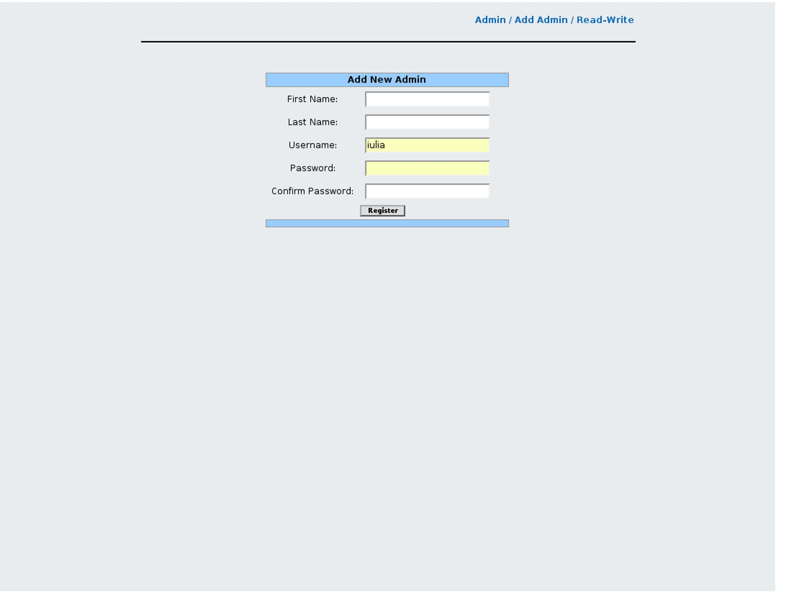

## Description

This tool allow you to add new admins into the ocp\_admin\_privileges table (for login into OpenSIPS Control Panel).

The admin can add a new admins to the list, by completing all the fields in the form (ID, names, password).

## Configuration

- Database layer configuration file : **opensips-cp/config/tools/admin/add\_admin/db.inc.php** Attributes set in this file :
  - database host
  - database port
  - database username
  - database password
  - database name
- Local configuration file : **opensips-cp/config/tools/admin/add\_admin/local.inc.php** Attributes set in this file :
  - database table name $config->table\_addadmin = "ocp\_admin\_privileges";
  - Attributes like database table name, fifo file name and variables which control the way the tool displays information from database. The following variables present in this file may be subject to change more often: **$config->passwd\_mode.**
    1. This array controls the way the admin password is going to be saved in the database, by setting: $config->passwd\_mode=0 the password will be saved in a text mode, by setting:
    2. $config->passwd\_mode=1 the password will be saved in a chyphered way (password field will be empty and ha1 will be calculated)

## Screenshots

