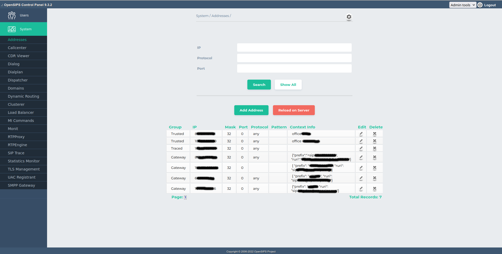

## Description

The Addresses tool maps on the [Permissions OpenSIPS module](https://docs.opensips.org/manual/3-3/modules/permissions), the addresses table. It is used for determining permission based on IP addresses or ranges of IPs.

This tool allows deleting, searching and adding IP matching rules, and it also lists the whole address table content.

- "Search": Searches through the address rules, displaying only the rules that have the IP and Protocol submited by the user.
- "Show all": Shows all the address rules
- "Delete Address": Deletes all entries with a certain IP and Protocol.
- "Add New": Inserts a form to add new address rule.

> [!NOTE]
> All the changes are done in database. To apply them into your OpenSIPS, you need to click on *Reload on Server* button

## Configuration

Tool specific settings are configurable via the setting panel - see gear-icon in the tool header.

All settings are explained via ToolTip and have format validation.

## Screenshots

