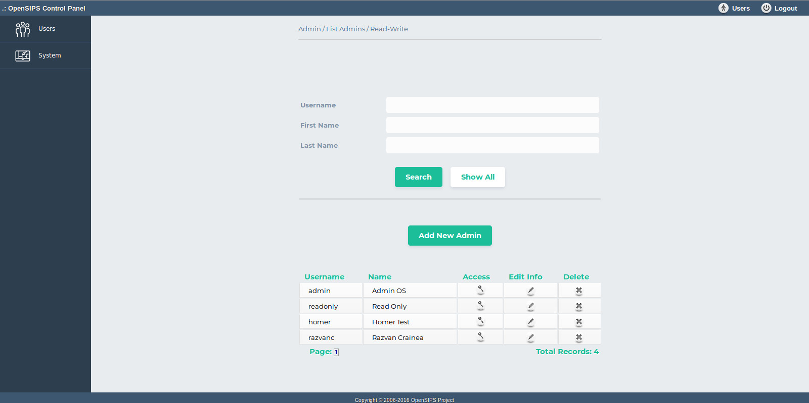
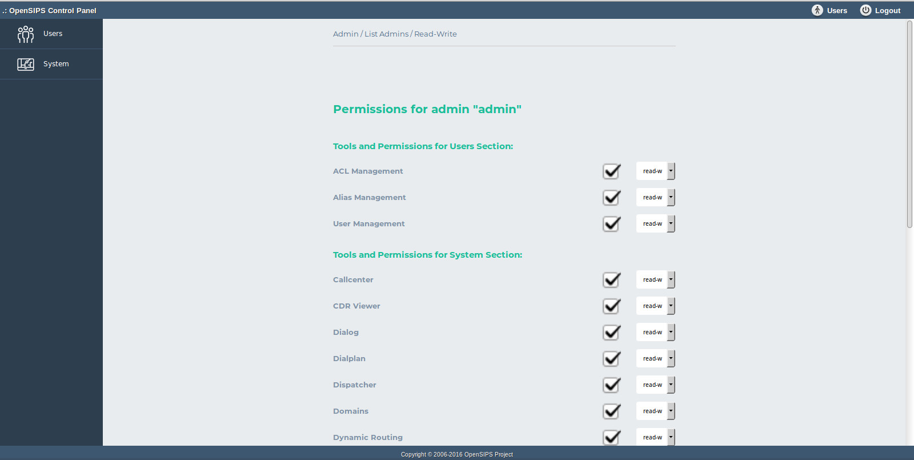

## Description

This tools allows adding, listing, deleting and modifying the user login/access to OCP.

You can search by username, first name and last name, or show all records that are in the table. For each admin you can edit the personal info, which tools which are available for him, and the type of acces (read-only / read-write) for each tool.

## Configuration

- Database layer configuration file : **opensips-cp/config/tools/admin/list\_admins/db.inc.php** Attributes set in this file :
  - database host
  - database port
  - database username
  - database password
  - database name
- Local configuration file : **opensips-cp/config/tools/admin/list\_admins/local.inc.php** Attributes set in this file :
  - database table name $config->table\_addadmin = "ocp\_admin\_privileges";
  - Attributes like database table name, fifo file name and variables which control the way the tool displays information from database. The following variables present in this file may be subject to change more often: **$config->passwd\_mode.**
    1. This array controls the way the admin password is going to be saved in the database, by setting: $config->passwd\_mode=0 the password will be saved in a text mode, by setting:
    2. $config->passwd\_mode=1 the password will be saved in a chyphered way (password field will be empty and ha1 will be calculated)

## Screenshots

