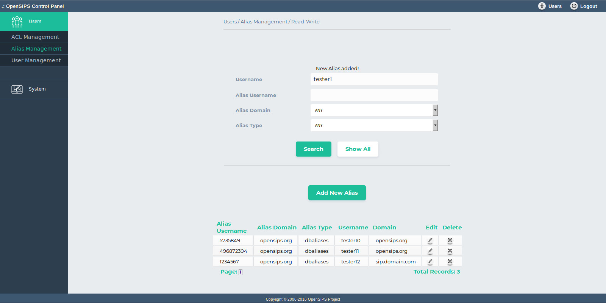

## Description

This tool allows alias provisioning for the SIP users (from the subscriber table). The tools provides the posibility to use multiple alias-like tables in the same time (this is mapped over the 'alias type' concept).

You can search by alias username, alias domain and alias type, or show all records. In terms of operations, you can add a new alias, edit or delete a certain alias.

## Configuration

- Database layer configuration file : **opensips-cp/config/tools/users/alias\_management/db.inc.php** Attributes set in this file :
  - database host
  - database port
  - database username
  - database password
  - database name
- Local configuration file : **opensips-cp/config/tools/users/alias\_management/local.inc.php** Attributes set in this file :
  1. Attributes like variables which control the way the tool displays information from database.
    ```
    // Sets number of results listed on a page
    $config->results_per_page = 10;
    //Sets number of pages per range	
    $config->results_page_range = 10;
    ```
  2. Parameter used for the aliases tables if there are more than the standard dbaliases table. The defined array has as key the label and as value the table name.For defining more than one attribute/value pair, complete the list with identical elements separated by comma.
    ```
    $config->table_aliases = array("DBaliases"=>"dbaliases");
    ```
  3. Pattern/regexp to validate the inserted aliases (in order to enforce a certain format for the aliases).
    ```
    $config->alias_format = "/^[0-9a-zA-Z]+/";
    ```

## Screenshots


