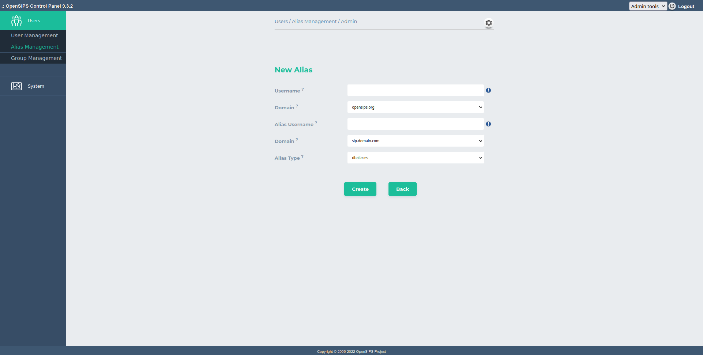

## Description

This tool allows alias provisioning for the SIP users (from the subscriber table). The tools provides the posibility to use multiple alias-like tables in the same time (this is mapped over the 'alias type' concept).

You can search by alias username, alias domain and alias type, or show all records. In terms of operations, you can add a new alias, edit or delete a certain alias.

This tool maps over the [*alias\_db* module](https://docs.opensips.org/manual/3-3/modules/alias_db) from OpenSIPS.

## Configuration

Tool specific settings are configurable via the setting panel - see gear-icon in the tool header.

All settings are explained via ToolTip and have format validation.

## Screenshots

