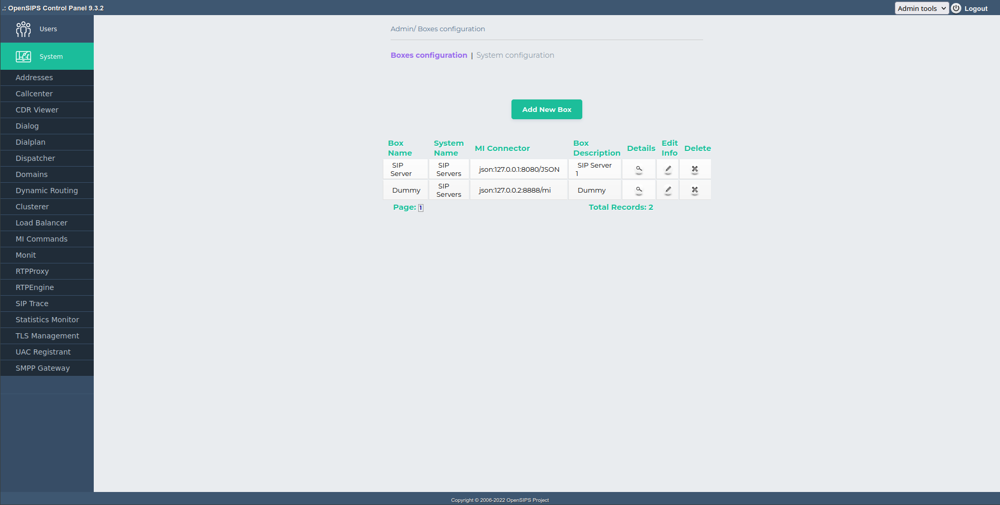
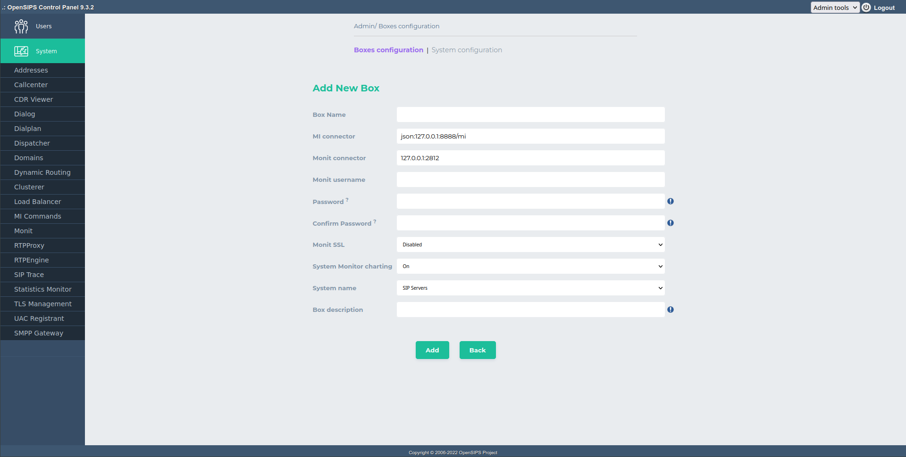
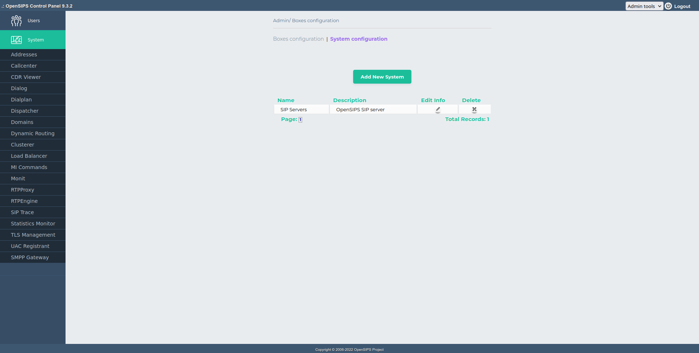
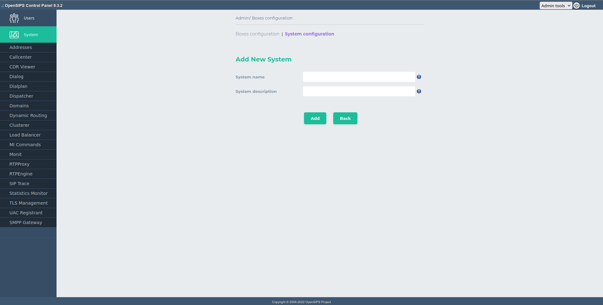

This tools allows full management of the OpenSIPS Boxes/System the OCP should work with. This "Boxes" tool can be accessed via the "Admin Tools" drop-down selector in the right side of the upper bar.

An OCP instance may need to interact with multiple OpenSIPS instances (boxes) (like with clusters of OpenSIPS, or multiple OpenSIPS boxes part of the same platform/service). For an easy deployment of the Opensips Control Panel , this tool alows the centralized / global defintion of the OpenSIPS boxes (as various setting) - these settings may be used by multiple tools.

Each OpenSIPS instance (or box) has an unique identification - for each of it, you must configure a set of properties, like the IP addresses of the machine, MI connector, Monit connector or if statistic sampling should be done.

Multiple boxes may be grouped into a System (multiple Systems are possible). Systems are needed as OCP provided some tools that need to interact with multiple OpenSIPS boxes in the same time - so, such tools are actually interacting with a System. Like the Dynamic Routing tool needs to perform reload on all the OpenSIPS boxes doing drouting. Similar the clusterer tools has to know all the OpenSIPS nodes into a cluster in order to reload data.

This "Boxes" tools allows to create, view, edit or delete boxes and systems. The definitions are stored in the databases.

## Boxes Screenshots

## System Screenshots

