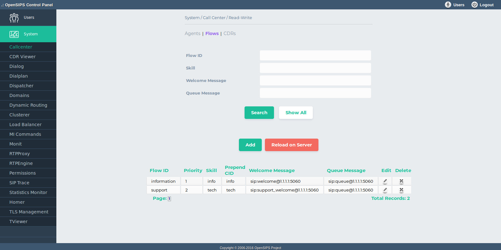

## Description

The tool is used for provisioning the OpenSIPS callcenter module. You can add , delete and edit the Agents and Flows and view callcenter CDRs.

A complete description of the Call Canter module functionlity can be found in [Call Center module documentation](https://docs.opensips.org/manual/3-3/modules/call_center)

The tool features three tabs : Agents , Flows and CDRs . When "Apply changes to server" button is triggered the callcenter configuration will be loaded into OpenSIPS.

> [!NOTE]
> All the changes are done in database. To apply them into OpenSIPS, you need to click on the "Apply changes to server" button.

## Configuration

Tool specific settings are configurable via the setting panel - see gear-icon in the tool header.

All settings are explained via ToolTip and have format validation.

## Screenshots

