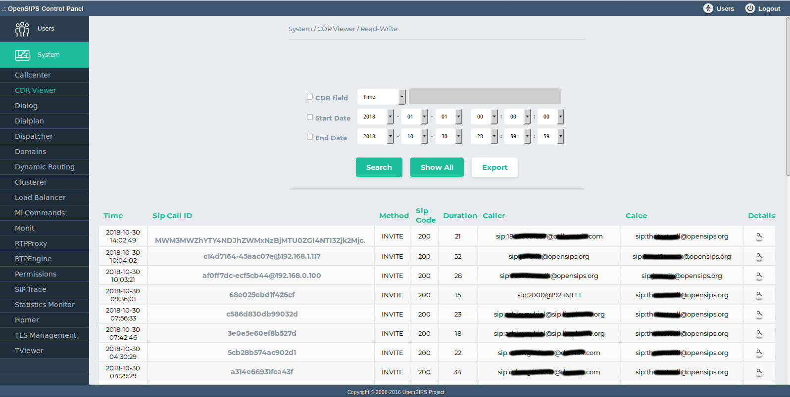

## Description

It shows Call Detail Records(CDRs) from the database. You have the possibility to filter CDRs and to export CDRs in csv (comma-separated values) files.

For viewing and exporting the CDRs you can select (see configuration section) what fields of the CDRs to be displayed or exported. Both operations can be extended to cover all the extra accouted fields from OpenSIPS config file.

You can search by any field and use a wildcard ( '%' - matches a set of characters ). The filters "CDR Field" , "Start Date" , "End Date" can be applied in parallel.

With the help of this tool you can export CDR records in a csv file. The filters applied on "Search" are working on the exported CDRs as well, so it exports what is displayed. When the "Export" button is pressed a download pop-up will show in your browser.

There is a feature to jump to SIP trace of the CDR (if such records exist) if you have enabled the SIPTrace tool - the juml link is behind the 'SIP Call ID' value of the CDR. The correlation between CDRs and the SIPTrace tool is done following the \`call\_id\` field which is common for both cdrs and siptrace tables.

## Configuration

- Database layer configuration file : **opensips-cp/config/tools/system/cdrviewer/db.inc.php** Attributes set in this file :
  - database host
  - database port
  - database username
  - database password
  - database name
- Local configuration file : **opensips-cp/config/tools/system/cdrviewer/local.inc.php** Attributes set in this file :
  - $show\_field This array controls which fields from the database are to be displayed. The order in which the fields are placed in the csv file can be established by modifying the array index. $show\_field\[index\]\['database\_field\_name'\] = "Field Description | Field\_Type"; Field Description is a column description that will show on cdrviewer tool. Field\_Type is the type of the record that will be displayed ( int or string ) depending on the type of the record in the database.
  - $export\_csv This array is used only by the cdr\_exporter.php script which is a command-line script ment to export cdr records from the database into csv files. (The inner workings of this script are detailed in a different file) $export\_csv\[index\]\['database\_field\_name'\] = "Field Description"; The order in which the fields are placed in the csv file can be established by modifying the array index. Field Description is the description that will show in the exported csv file. The presence of field description in the csv files is optional because automated tools might be configured to work on this file.

## Screenshots

