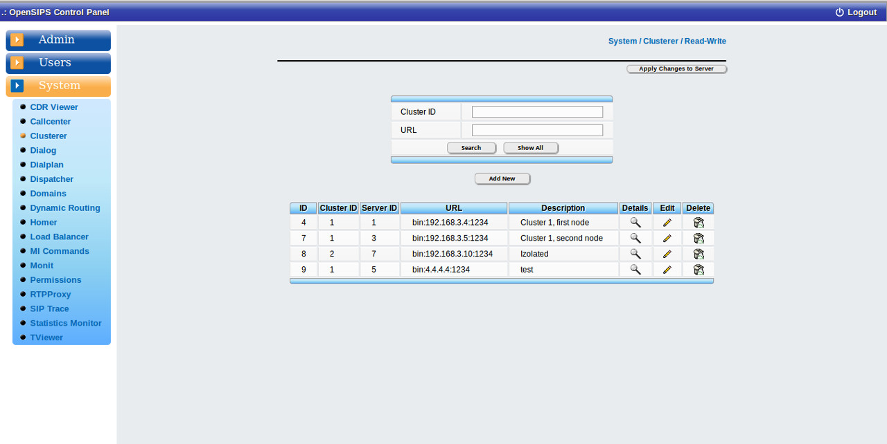

## Description

The Clusterer tool maps over the [Clusterer OpenSIPS module](https://docs.opensips.org/manual/2-3/modules/clusterer), allowing full provisioning and monitoring of a cluster of OpenSIPS servers.

The tool provide standard provisioning operations like adding, editing and deleting nodes from the OpenSIPS clusteres - all these are DB operations. To push your changes into OpenSIPS you need to force OpenSIPS to DB reload by using the *Apply changes to server* button.

## Configuration

- Database layer configuration file : **opensips-cp/config/tools/system/clusterer/db.inc.php** Attributes set in this file :
  - database host
  - database port
  - database username
  - database password
  - database name
- Local configuration file : **opensips-cp/config/tools/system/clusterer/local.inc.php** Attributes set in this file :
  - $config->table\_clusterer The name of the DB table holding the cluster configuration (this needs to be correlated with the OpenSIPS configuration). The default value is "clusterer".
  - $talk\_to\_this\_assoc\_id As OCP can manage multiple OpenSIPS instances, this is the association ID pointing to the group of servers (system) which needs to be provision with this clusterer information.

## Screenshots

