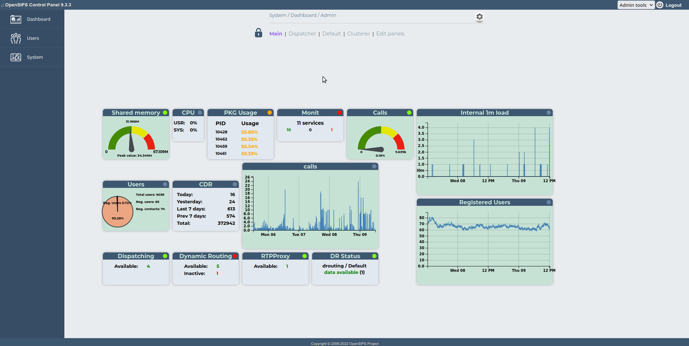
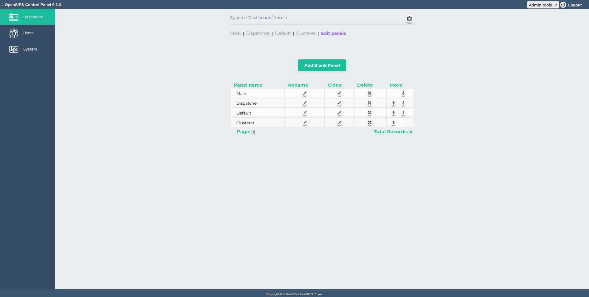
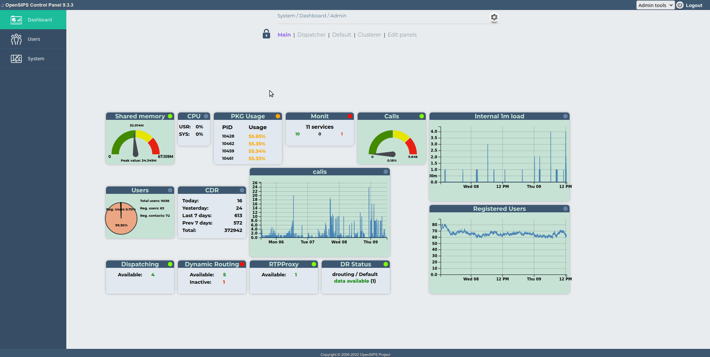

## Description

The Dashboard tool provides the ability to build (several) panels to hold a custom selection of widgets.

### Panels

A panel is a custom collection of widgets to be displayed in the same time. Several dasboard panels may be definied, with different names. The tool allows you also to control the order of the dashboard panels.

Inside a panel, the widgets may be re-arranged with drag and drop (you need to enter in edit mode for the panel). Also each widget may be edited (as name and properties).

### Widgets

A widget is the basic element of the dashboard, displaing a piece of information - text, chart or image. The widgets are provided by the other OCP tools, displaying information relevant to that tool (like the Dynamic Routing tool provides a widgets to overview the status of the defined gateways).

Each widgets comes with a description and several parameters (specific to the widget) for customizing the widget.

The widget may report and display a "status" dot/indicator in its left side of the title bar. This indicator may be:

- **red** if the widget reports a critical issue (like memory exceeded critical threhold, or some GWs are inactive)
- **orange** if the widget reports a warning (like memory exceeded warning threhold, or some GWs are in probing)
- **green** if there are no issues detected
- **dark blue** if the widget does not report any status

- **link to the parent tool** to jump to the tool providing the widget
- **link to the staus-report tool** to jump to the status-report tool (if loaded), so you can check the reports prvided by the parent tool (providing the widget)

## Configuration

Tool specific settings are configurable via the setting panel - see gear-icon in the tool header.

All settings are explained via ToolTip and have format validation.

## Screenshots

