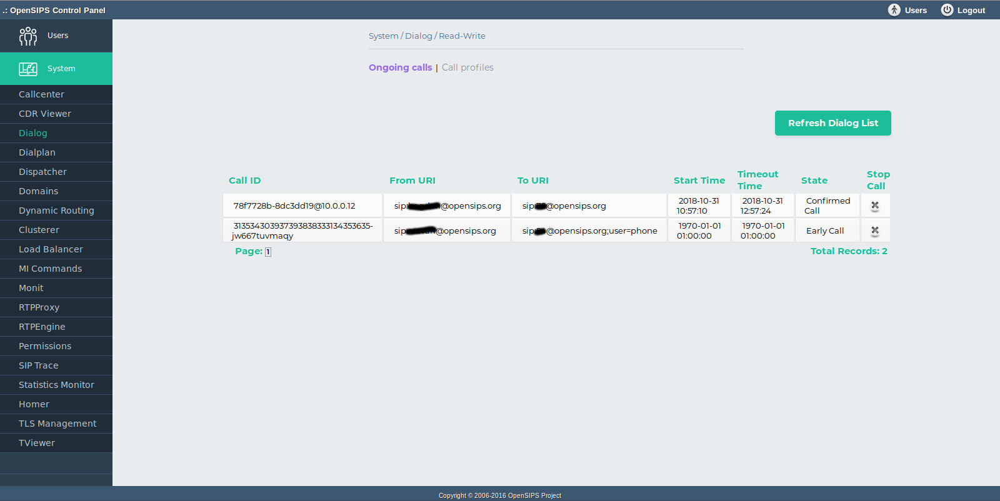

## Description

The OCP dialog tool comes to mapps over the [Dialog OpenSIPS module](https://docs.opensips.org/manual/3-3/modules/dialog) (for keeping track of the ongoing SIP calls in OpenSIPS).

The tools provides a listing of the ongoing calls (directly fetched from OpenSIPS internals via Management Interface) and the possibility to terminate a specific call.

Also it provides access to the dialog profile - by selecting an existing profile, you can see how many ongoing calls are in that profile, and optional, the actual listing of those calls.

## Configuration

Tool specific settings are configurable via the setting panel - see gear-icon in the tool header.

All settings are explained via ToolTip and have format validation.

## Screenshots

