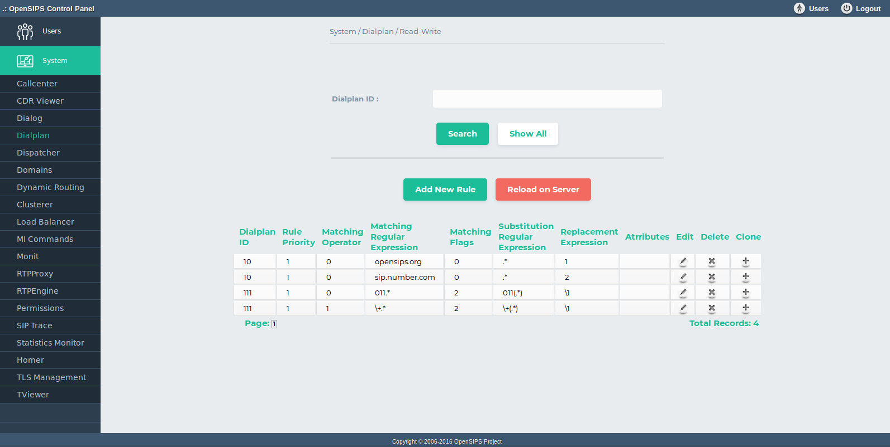

## Description

The OCP dialplan tool maps over the [Dialplan OpenSIPS module](https://docs.opensips.org/manual/3-3/modules/dialplan). The tool is used to perform modifications in OpenSIPS's dialplan rules during runtime. The rules are kept in a database and they can be reloaded into OpenSIPS from the web interface (see the *Reload on Server* button).

The tool displays a table with the OpenSIPS dialplan rules, offering the ability to add, edit, clone or delete rules.

Following is an explanation of the actions performed by the buttons on the page:

- "Search": Searches through the dialplan rules, displaying only the rules with the dialplan ID submited by the user.
- "Show all": Shows all the dialplan rules from all dialplans.
- "Clone Dialplan": Creates a new entry of the selected dialplan rule identical with the selected one.
- "Delete Dialplan": Deletes all entries with a certain dialplan ID.
- "Add New Rule": Inserts a form to add new rule into dialplan.

> [!NOTE]
> All the changes are done in database. To apply them into your OpenSIPS, you need to click on "Reload on Server" button

## Configuration

Tool specific settings are configurable via the setting panel - see gear-icon in the tool header.

All settings are explained via ToolTip and have format validation.

## Screenshots

