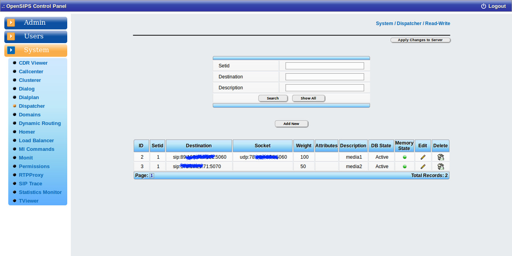

## Description

This tool maps over the [Dispatcher OpenSIPS module](https://docs.opensips.org/manual/2-3/modules/dispatcher), which implements a dispatching routing over a set of destination addresses.

The tool provides support for provisioning the dispaching sets (and their entries) - you can add, edit or delete a rule from a specific dispatching set. Following is an explanation of the actions performed by the buttons on the page:

- "Search": Searches through the dispatcher rules, displaying only the rules with the Setid, Destination and Description submited by the user.
- "Show all": Shows all the dispatcher rules
- "Delete Dispatcher": Deletes all entries with certain Setid, Destination and Description.
- "Add New": Inserts a form to add new rule into dispatcher.

Besides the DB provisioning, the tools is also providing realtime information about the status of each dispatching destination - if enabled or not, if in probing mode. This state can be changed via the tool also. This interaction with OpenSIPS is done via Management Interface.

## Configuration

- Database layer configuration file : **opensips-cp/config/tools/system/dispatcher/db.inc.php** Attributes set in this file :
  - database host
  - database port
  - database username
  - database password
  - database name
- Local configuration file : **opensips-cp/config/tools/system/dispatcher/local.inc.php** Attributes set in this file :
  - $config->table\_dispatcher the database table name for storing the dispatcher data
  - $config->results\_per\_page and $config->results\_page\_range control over the pagination when displaying the dispatcher destinations
  - $talk\_to\_this\_assoc\_id As OCP can manage multiple OpenSIPS instances, this is the association ID pointing to the group of servers (system) which needs to be provision with this dispatching information.

## Screenshots

