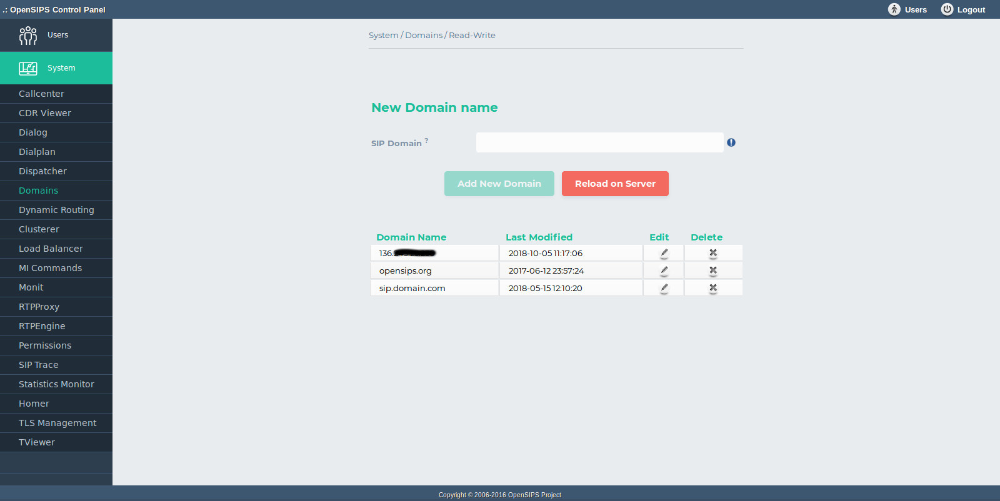

## Description

The Domains tool maps over the [Domain OpenSIPS module](https://docs.opensips.org/manual/2-4/modules/domain). The tools is used to perform modifications in OpenSIPS's local domain list during runtime. The domain names are kept in a database and they can be re-loaded into OpenSIPS via OCP.

The user can list, add, edit and delete domains. When "Apply changes to server" button is triggered the domains will be loaded from the database into OpenSIPS.

- Database layer configuration file : **opensips-cp/config/tools/system/domains/db.inc.php** Attributes set in this file :
  - database host
  - database port
  - database username
  - database password
  - database name
- Local configuration file : **opensips-cp/config/tools/system/domains/local.inc.php** Attributes set in this file :
  - $config->table\_domains the database table name for storing the domain entries
  - $talk\_to\_this\_assoc\_id As OCP can manage multiple OpenSIPS instances, this is the association ID pointing to the group of servers (system) which needs to be provision with this domain information.

## Screenshots

