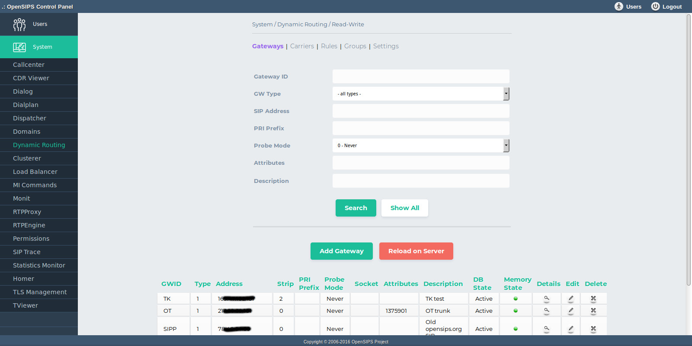
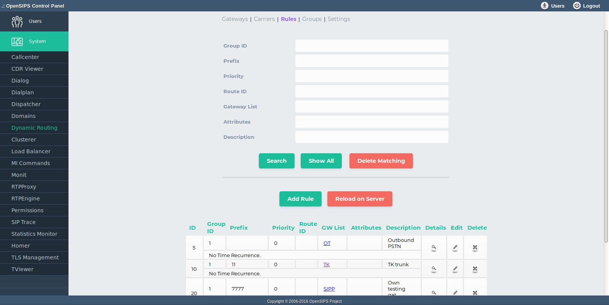

## Description

The Dynamic Routing OCP tool maps on the [Dynamic Routing (drouting) OpenSIPS module](https://docs.opensips.org/manual/2-4/modules/drouting). It is used for provisioning the OpenSIPS drouting information, to add, modify and delete the Gateways, Carriers and Rules.

The tool features multiple tabs : Gateways , Carriers, Rules, Groups and Settings. All the provisioning operations are performed in the DB. In oder to force the reloading of the DB data into OpenSIPS, be sure to use the *Apply changes to server* button (this will trigger a reload command via the Management Interface).

## Configuration

- Database layer configuration file : **opensips-cp/config/tools/system/drouting/db.inc.php** Attributes set in this file :
  - database host
  - database port
  - database username
  - database password
  - database name
- Local configuration file : **opensips-cp/config/tools/system/drouting/local.inc.php** Attributes set in this file :
  - $config->table\_gateways, $config->table\_groups, $config->table\_rules, $config->table\_carriers the database table names for storing the drouting data
  - $config->results\_per\_page and $config->results\_page\_range control over the pagination when displaying the dialplan rules
  - $talk\_to\_this\_assoc\_id As OCP can manage multiple OpenSIPS instances, this is the association ID pointing to the group of servers (system) which needs to be provision with this drouting information.
  - $config->group\_id\_method How the handle the drouting groups : "static" - the groups are statically configured via the "Settings" tab ; "dynamic" - the groups are read from the DB group table.

## Screenshots

