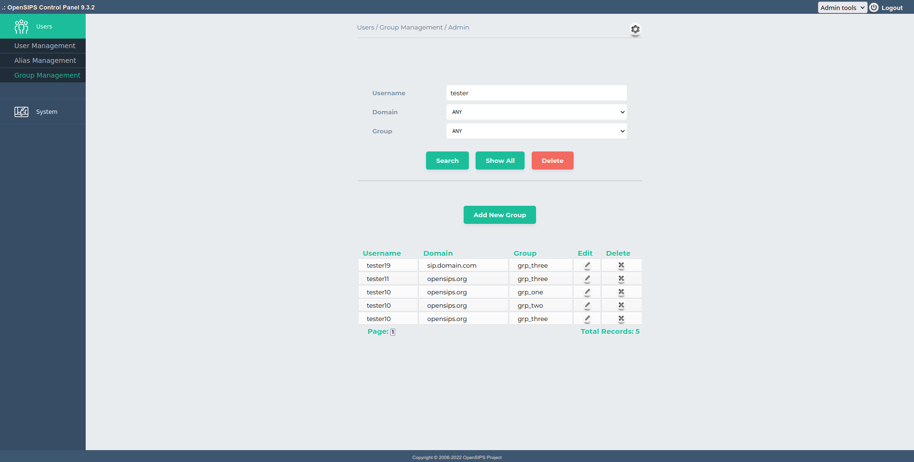
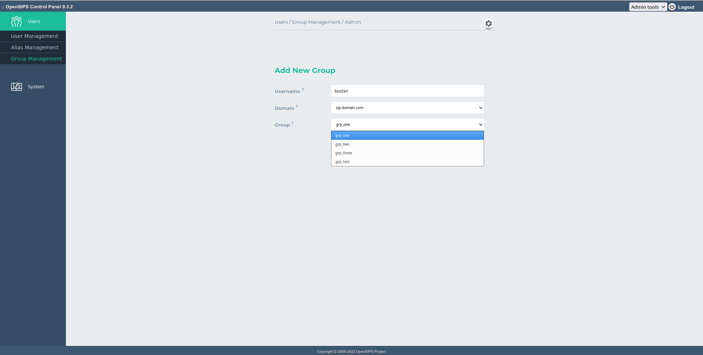

## Description

This tool allows groups provisioning for the SIP users (from the subscriber table). A group reflects a certain permission and if a users belongs to that group, it means the user has that certain permission.

You can search by username, domain and group, or show all records. In terms of operations, you assign or un-assign a SIP user to one or multiple groups.

For easy management, the groups are to be predefined as a tool setting.

This tool maps over the [*group* module](https://docs.opensips.org/manual/3-3/modules/group) from OpenSIPS.

## Configuration

Tool specific settings are configurable via the setting panel - see gear-icon in the tool header.

All settings are explained via ToolTip and have format validation.

## Screenshots

