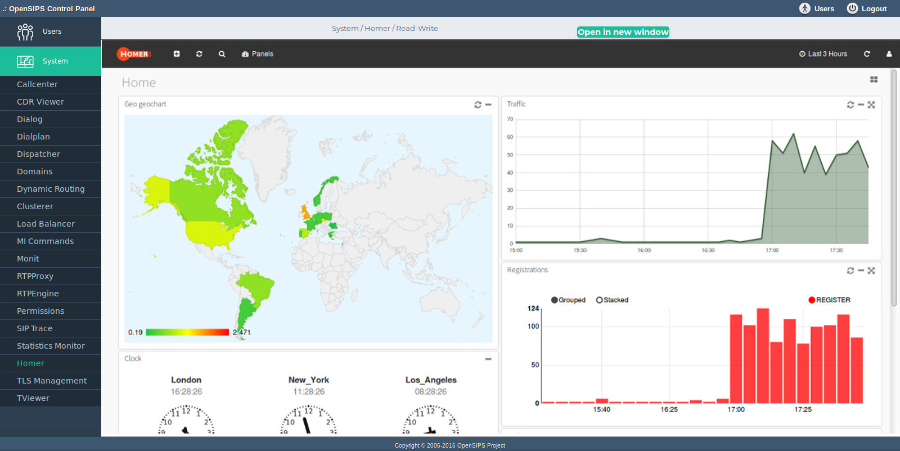

## Description

The Homer tool provides an integration with the [HOMER portal for SIP Capturing](http://sipcapture.org/). This integration aims to offer a single login experience for twp differnet web portals (OCP and HOMER).

Of course, the Homer portal must be installed and configured (same or different machine).

## Configuration

- Local configuration file : **opensips-cp/config/tools/system/homer/local.inc.php** Attributes set in this file :
  - $homer\_URL The Homer HTTP(s) URL - where the portal is installed. Please note that you need to configure Homer portal to perform external authentication (versus local auth with user and password)
  - $homer\_auth\_method The authentication method to be used against HOMER. It can be:
    - cookie - the auth ID will be passed as an HTTP cookie to the HOMER portal ; this will require to set the $common\_subdomain too !
    - get - the auth ID will be passed as an GET parameter to the HOMER portal; nothing more is required; this is a much more flexible approach.
  - $common\_subdomain The common HTTP subdomaim shared between the CP URL and HOMER URL. This is used for cookie transfer and must include at least 2 levels (.com is not considered a valid subdomain).

## Screenshots

