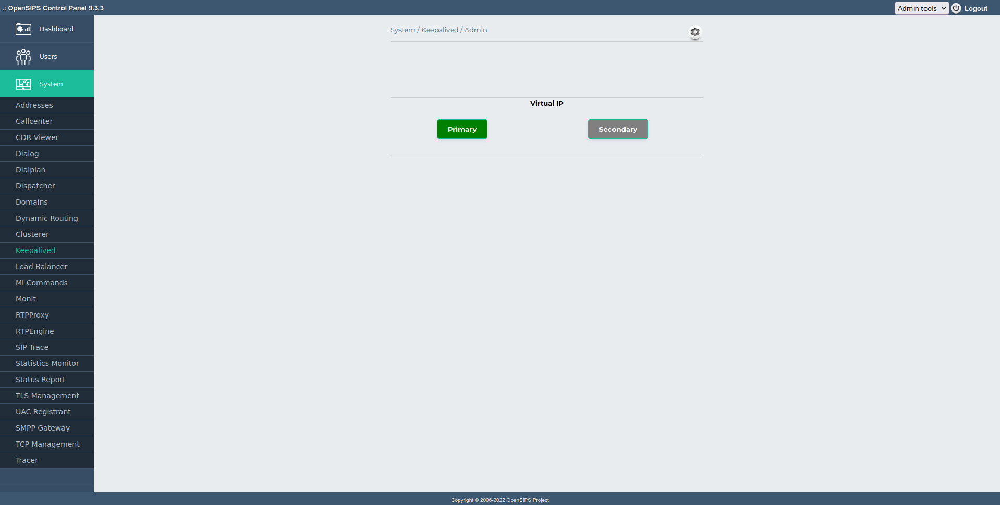
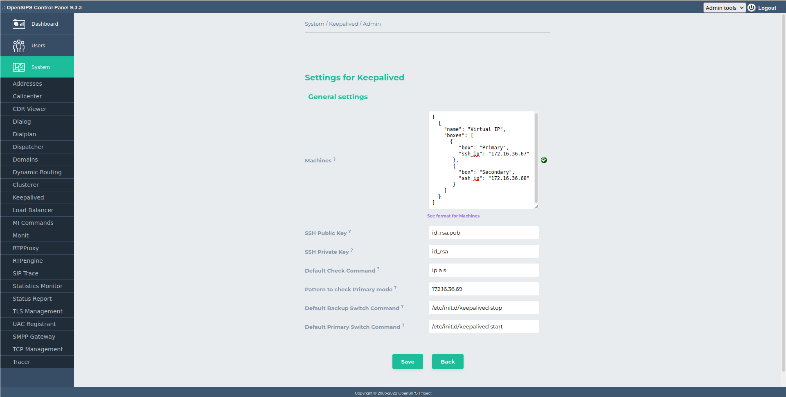

## Description

The Keepalived provides the means to view and manage the state of keepalived cluster.

The module connects (through ssh) to each machine/node within the cluster to check its state and displays it in the main page.

## Clusters

Each keepalived cluster consists of multiple nodes that share the same Virtual IP. Multiple clusters are organized vertically in the page, each cluster having its nodes displayed horizontally.

Green nodes within a cluster are the Primary nodes (the nodes that have the Virtual IP active), and the gray ones are Backup nodes. Red nodes indicate failure (i.e. bad ssh communication with the node, etc.). At a certain moment of time, there can be maximum one Primary node in a cluster; having multiple nodes as primary is considered a misconfiguration/failure, and the nodes will be coloured in red.

## Status Check

For each node within a cluster you can define a custom command and a pattern to check whether the node is Primary or backup.

A simple example of such command (and the default behavior) is to check whether the Virtual IP is assigned on the interface. A more complex one would be to query a service (such as a cloud provider) that can provide this information. The command is executed locally, on each node, over an SSH connection.

## Node Switching

The module even allows you to switch a node as Primary by clicking on it. When doing that, a command is executed on each node within the cluster: a command to turn the node as Primary is executed on the primary node, and a command to turn the nodes as backups is executed on all the others.

This is useful when running the module in a cloud that exposes an API to switch the services; you can use these hooks to instruct the cloud provider that a switch has to be done. By default this switching is disabled, unless an explicit switch command for primary/backup is configured.

## Dependencies

The module depends on the ssh2 php extension to run, thus it has be be manually installed and setup before using the module. For example, on Debian systems you can run **apt-get install php-ssh2**.

*Do not forget to restart Apache after all the php changes!!!*

## Configuration

Tool specific settings are configurable via the setting panel - see gear-icon in the tool header.

All settings are explained via ToolTip and have format validation.

## Screenshots

