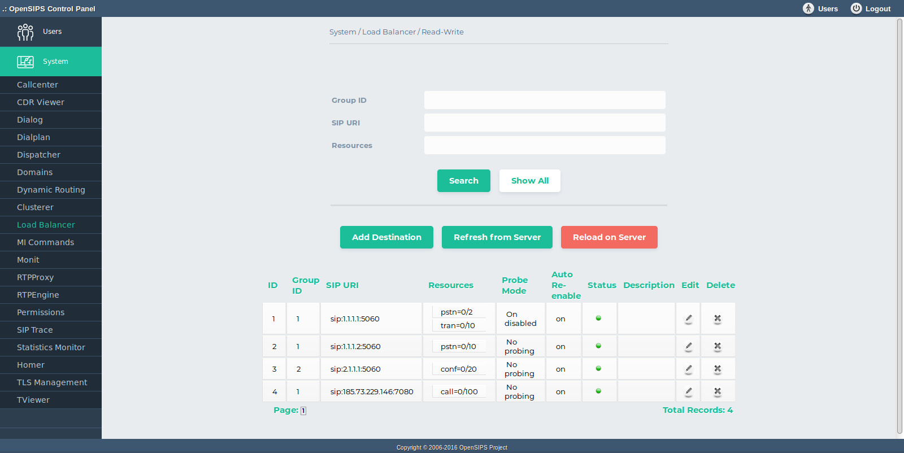

## Description

The Load Balancer tool is an interface to the [Load Balancer module within OpenSIPS](https://docs.opensips.org/manual/2-4/modules/load_balancer). The tool is performing standard DB provisioning of the load-balancer entries - add, delete, search and listing. The DB listing is aggregated with information from OpenSIPS internals, like the status of the destination (active, disabled, probing) or the current load of the destination (per resource). The OpenSIPS internal information is fetched via Management Interface. The status of a destination can be also changed from the tool.

After peforming any DB change over the Load Balancer data, be sure to trigger a DB reload in OpenSIPS by using the *Apply Changes to Server* button.

## Configuration

- Database layer configuration file : **opensips-cp/config/tools/system/loadbalancer/db.inc.php** Attributes set in this file :
  - database host
  - database port
  - database username
  - database password
  - database name
- Local configuration file : **opensips-cp/config/tools/system/loadbalancer/local.inc.php** Attributes set in this file :
  - $config->table\_lb the database table name for storing the Load Balancer destinations
  - $config->results\_per\_page and $config->results\_page\_range control over the pagination when displaying the Load Balancer destinations
  - $talk\_to\_this\_assoc\_id As OCP can manage multiple OpenSIPS instances, this is the association ID pointing to the group of servers (system) which needs to be provision with this Load Balancer information.

## Screenshots

