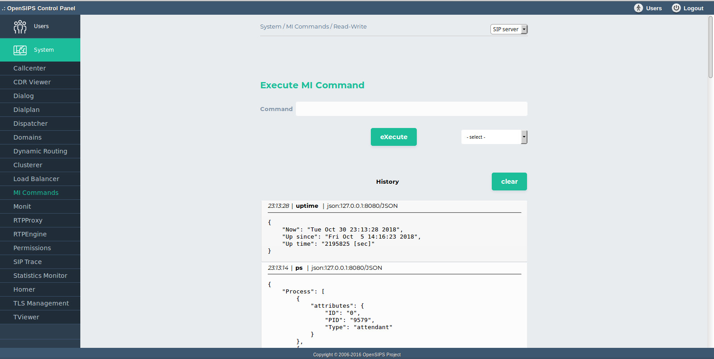
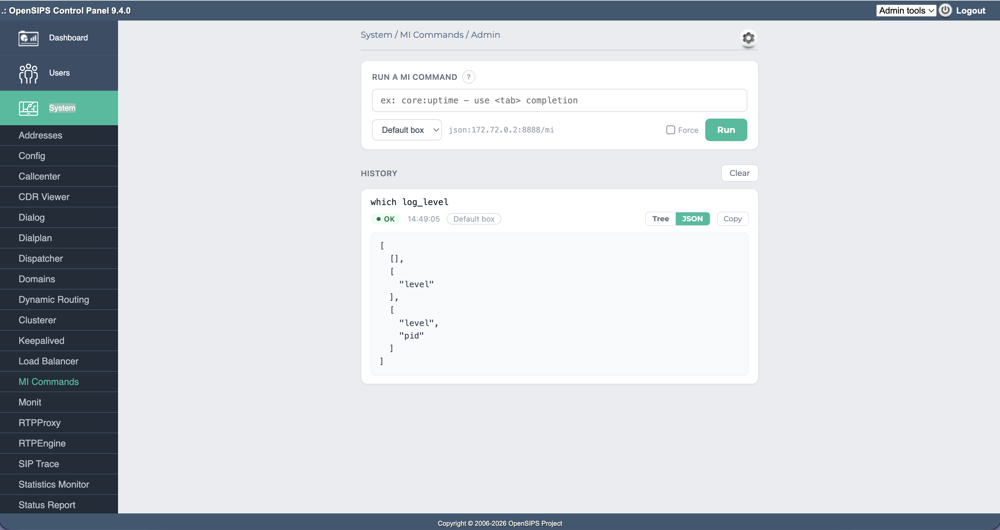

## Description

MI stands for [Management Interface](https://docs.opensips.org/manual/3-2/interface-mi). The tool offers the possibility to execute commands - via the JSONRPC backend- on the OpenSIPS servers configured on the platform.

> [!NOTE]
> This is a form of low level access to the server management.

The tool presents an input box for commands. It also has a drop down box with pre-configured SIP Servers to easily switch between machines on your SIP platform. It has a drop down MI Command box with a listing of available commands. The commands can take arguments (parameters) and the command output is saved in the same web session.

This tool requires the [*mi\_http* module](https://docs.opensips.org/manual/3-3/modules/mi_http) from OpenSIPS.

## Configuration

The tool connects to the OpenSIPS servers configured as boxes, via the defined MI interface.

**MI connectod Example:**
: "json:127.0.0.1:8080/JSON"

## Screenshots

