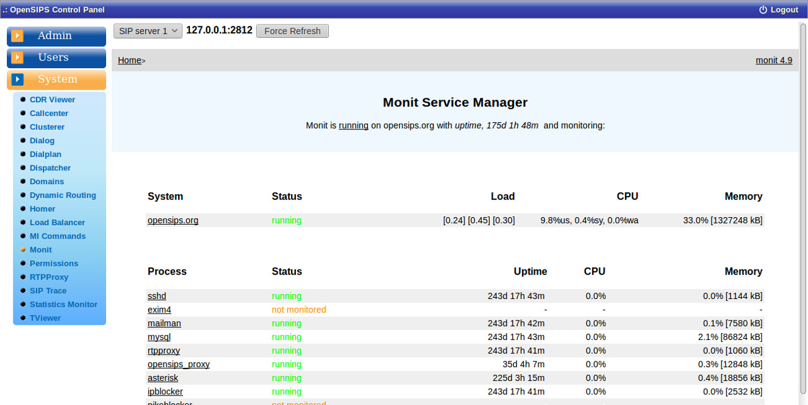

## Description

MONIT is a monitoring server (see [http://www.tildeslash.com/monit](http://www.tildeslash.com/monit) ). The Monit tool is a centralized point of access to the web interfaces of all MONIT servers configured across the SIP platform - it shows the status of machines and processes that are monitored.

The tool has a drop down box with pre-configured machines to easily switch between MONIT servers. The "Force Refresh" button will instantly refresh the page. Using the interface you can enable or disable monitoring for each process or host configured to be monitored by MONIT and you can also start or stop a service.

## Global Configuration

The Monit tool uses data from the global configuration file (global.boxes.inc.php).

```
$boxes[$box_id]['monit']['conn']="127.0.0.1:2812";
$boxes[$box_id]['monit']['user']="admin";
$boxes[$box_id]['monit']['pass']="pass";
$boxes[$box_id]['monit']['has_ssl']=1;
```

## Configuration File

The page refresh time is configurable in the local configuration file (opensips-cp/config/tools/monit/local.inc.php ) and it defaults to 15 seconds.

## Screenshots


