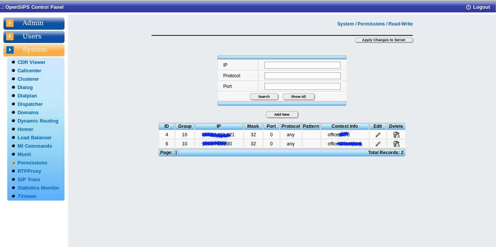

## Description

The permissions tool maps on the [Permissions OpenSIPS module](https://docs.opensips.org/manual/2-3/modules/permissions), the addresses table. It is used for determining permission based on IP addresses or ranges of IPs.

This tool allows deleting, searching and adding IP matching rules, and it also lists the whole address table content.

- "Search": Searches through the address rules, displaying only the rules that have the IP and Protocol submited by the user.
- "Show all": Shows all the address rules
- "Delete Address": Deletes all entries with a certain IP and Protocol.
- "Add New": Inserts a form to add new address rule.

> [!NOTE]
> All the changes are done in database. To apply them into your OpenSIPS, you need to click on *Apply Changes to Server* button

## Configuration

- Database layer configuration file : **opensips-cp/config/tools/system/permissions/db.inc.php** Attributes set in this file :
  - database host
  - database port
  - database username
  - database password
  - database name
- Local configuration file : **opensips-cp/config/tools/system/permissions/local.inc.php** Attributes set in this file :
  - $config->table\_address the database table name for storing the IP matching rules
  - $config->results\_per\_page and $config->results\_page\_range control over the pagination when displaying the IP matching rules
  - $talk\_to\_this\_assoc\_id As OCP can manage multiple OpenSIPS instances, this is the association ID pointing to the group of servers (system) which needs to be provision with this permissions information.

## Screenshots

