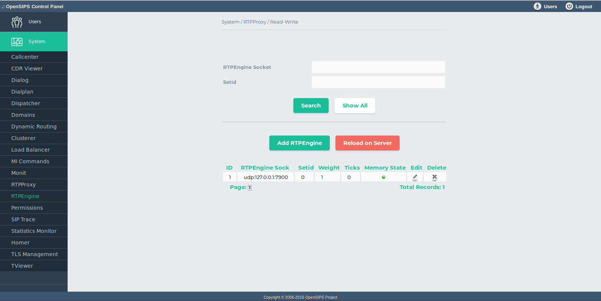

## Description

The RTPEngine OCP tool maps on the [RTPEngine OpenSIPS module](https://docs.opensips.org/manual/2-4/modules/rtpengine). It provides provisioning and monitoring capabilities for the list of RTPEngine relays used by OpenSIPS.

The tool provides standard DB operations for the RTPEngine sockets: add, delete, search and listing of the whole content of the table. As all the changes are done in database, to apply them into your OpenSIPS, you need to click on *Apply Changes to Server* button.

Beside the DB operations, the tool also aggregates the runtime status of rtpengine sockets (as internally provided by OpenSIPS via Management Interface). This provides additional information about the rtpengine sockets, as status (enabled, disabled) and recheck ticks. The status can be also be modified from the tool (enabled or disabled).

## Configuration

- Database layer configuration file : **opensips-cp/config/tools/system/rtpengine/db.inc.php** Attributes set in this file :
  - database host
  - database port
  - database username
  - database password
  - database name
- Local configuration file : **opensips-cp/config/tools/system/rtpengine/local.inc.php** Attributes set in this file :
  - $config->table\_rtpengine the database table name for storing the RTPEngine sockets
  - $config->results\_per\_page and $config->results\_page\_range control over the pagination when displaying the rtpengine sockets
  - $talk\_to\_this\_assoc\_id As OCP can manage multiple OpenSIPS instances, this is the association ID pointing to the group of servers (system) which needs to be provision with this rtpengine information.

## Screenshots

