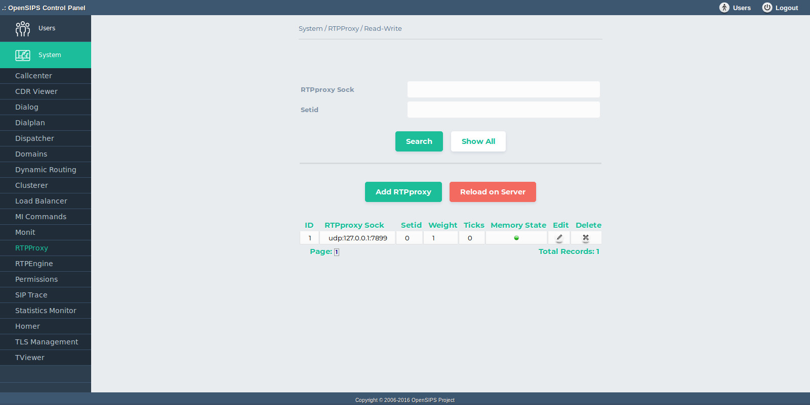

## Description

The RTPproxy OCP tool maps on the [RTPproxy OpenSIPS module](https://docs.opensips.org/manual/2-4/modules/rtpproxy). It provides provisioning and monitoring capabilities for the list of RTPproxy relays used by OpenSIPS.

The tool provides standard DB operations for the RTPproxy sockets: add, delete, search and listing of the whole content of the table. As all the changes are done in database, to apply them into your OpenSIPS, you need to click on *Apply Changes to Server* button.

Beside the DB operations, the tool also aggregates the runtime status of rtpproxy sockets (as internally provided by OpenSIPS via Management Interface). This provides additional information about the rtpproxy sockets, as status (enabled, disabled) and recheck ticks. The status can be also be modified from the tool (enabled or disabled).

## Configuration

- Database layer configuration file : **opensips-cp/config/tools/system/rtpproxy/db.inc.php** Attributes set in this file :
  - database host
  - database port
  - database username
  - database password
  - database name
- Local configuration file : **opensips-cp/config/tools/system/rtpproxy/local.inc.php** Attributes set in this file :
  - $config->table\_rtpproxy the database table name for storing the RTPproxy sockets
  - $config->results\_per\_page and $config->results\_page\_range control over the pagination when displaying the rtpproxy sockets
  - $talk\_to\_this\_assoc\_id As OCP can manage multiple OpenSIPS instances, this is the association ID pointing to the group of servers (system) which needs to be provision with this rtpproxy information.

## Screenshots

