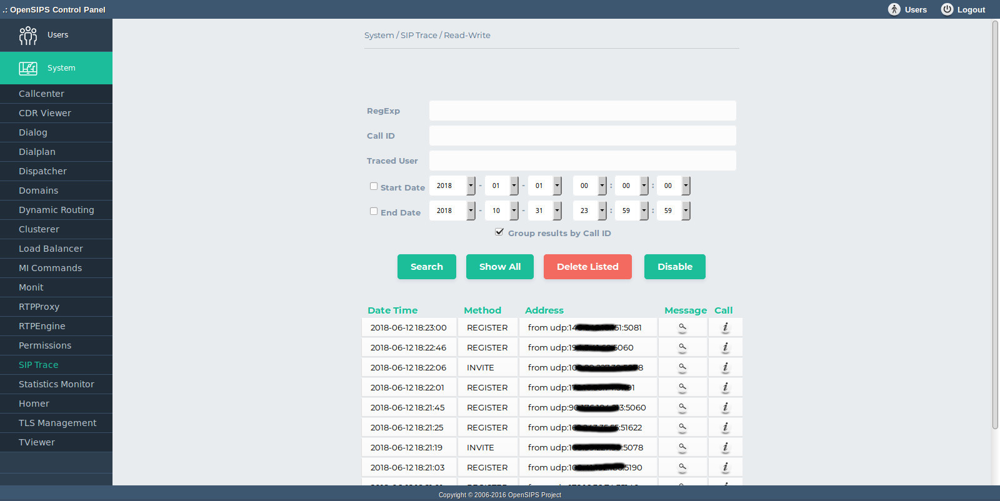
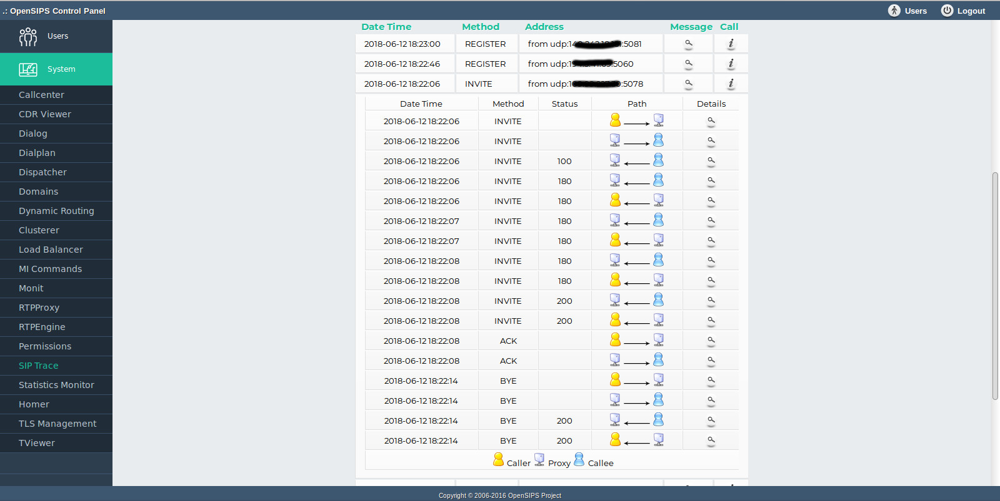

## Description

The siptrace tool maps on the [Tracer OpenSIPS module](https://docs.opensips.org/manual/3-3/modules/tracer). When the TRACER module is configured to do tracing to Database, this tool can be used to display the traced SIP traffic on the page in a nice graphical way (messages grouped under calls, with flow direction, etc)

Messages are grouped and collepsed based on SIP callid (for faster browsing). Each group can be expended (at message level) and information about the message flow (from/to caller/callee/proxy) will be displayed.

For narrowing the displayed messages, you can use a regexp (regular expression) filter.

You also have the options to see the actual content (full) of the messages you see (in a pop-up window). Special SIP headers (defining dialogs) are highlighted.

The tool interacts with OpenSIPS (via Management Interface - MI) for enabling/disabling the global tracing option in TRACER module.

## Configuration

Tool specific settings are configurable via the setting panel - see gear-icon in the tool header.

All settings are explained via ToolTip and have format validation.

## Screenshots

