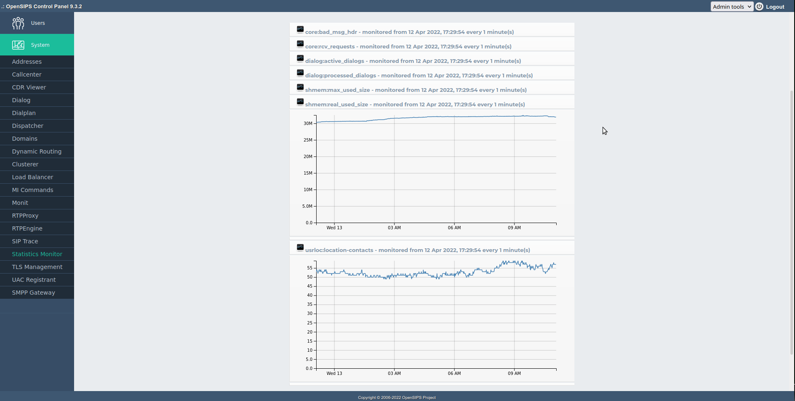
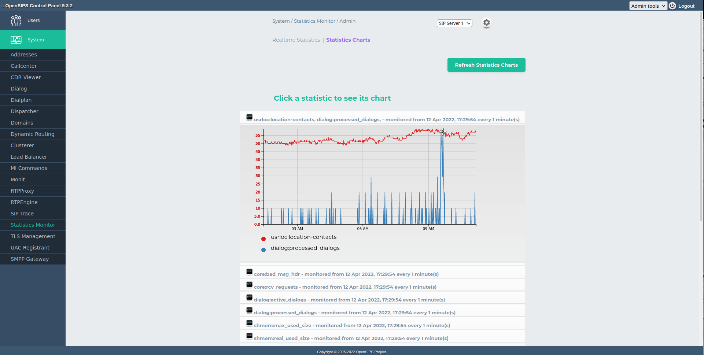

## Description

The Statistics Monitor tool is an viewer for the statistics provided by OpenSIPS via the [Statistics Inteface](https://docs.opensips.org/manual/3-2/interface-statistics). The tool is able to display realtime statistic values, but also to sample and to draw charts for the certain statistics (value history).

On the charting side, the tool (via its settings panel) allows the definition of multi-statistics charts - multiple statistics on the same chart.

The statistics monitor module has 2 tabs :

- Realtime Statistics Tab Displays each module that exports statistics . Clicking on the module will show its variables . The posibility to reset the variable exists. When the checkbox is enabled the variable will be drawed in the chart statistics .
- Statistics Charts Tab . Displays a chart (graph) with the evolution of the variable in time. A buttons to clear and refresh the Statistics Charts is present.

Don't forget to set up the additional tables and the cron script which gathers data from the OpenSIPS servers and inserts them into the DB tables (see [INSTALL](install.md) file).

This tool requires the [*mi\_http* module](https://docs.opensips.org/manual/3-3/modules/mi_http) from OpenSIPS.

## Configuration

Tool specific settings are configurable via the setting panel - see gear-icon in the tool header.

All settings are explained via ToolTip and have format validation.

## Screenshots

