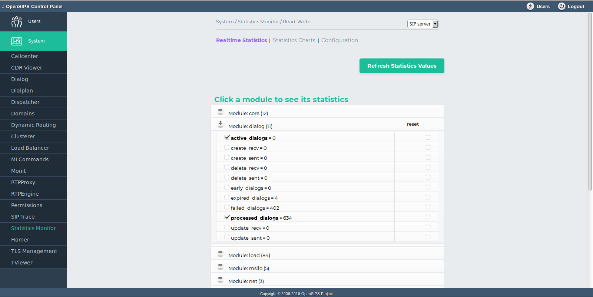
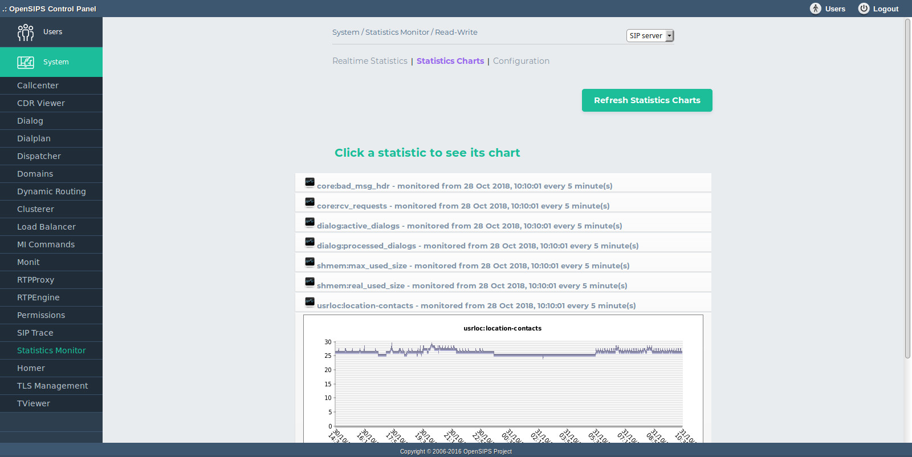

## Description

The Statistics Monitor tool is an viewer for the statistics provided by OpenSIPS via the [Statistics Inteface](https://docs.opensips.org/manual/2-4/interface-statistics). The tool is able to display realtime statistic values, but also to sample and to draw charts for the certain statistics (value history).

The statistics monitor module has 3 tabs :

- Realtime Statistics Tab Displays each module that exports statistics . Clicking on the module will show its variables . The posibility to reset the variable exists. When the checkbox is enabled the variable will be drawed in the chart statistics .
- Statistics Charts Tab . Displays a chart (graph) with the evolution of the variable in time. A buttons to clear and refresh the Statistics Charts is present.
- Configuration Tab.
  - The Sampling Time of the chart - how often the sampling should be done (smaller value means more accurate chart, but more load on your OpenSIPS). NOTE: changing this value will delete the history!
  - The Chart Size can be configured.
  - The Chart History : auto mode - 3 days (default) or it can be manually changed at 1 month interval ( in one-day steps) .

Don't forget to set up the additional tables and the cron script which gathers data from the OpenSIPS servers and inserts them into the DB tables (see [INSTALL](install.md) file).

## Configuration

- Database layer configuration file : **opensips-cp/config/tools/system/smonitor/db.inc.php** Attributes set in this file :
  - database host
  - database port
  - database username
  - database password
  - database name
- Local configuration file : **opensips-cp/config/tools/system/smonitor/local.inc.php** Attributes set in this file :
  - $config->table\_monitored and $config->table\_monitoring the database table names for storing the monitoring data
  - $config->sampling\_time DEfault value for the sampling interval (in seconds)
  - $config->chart\_size The horizontal size of the charts (as number of samples/dots)
  - $config->chart\_history Amount of smaples (per statistics) to be kept before start deleting them

## Screenshots

