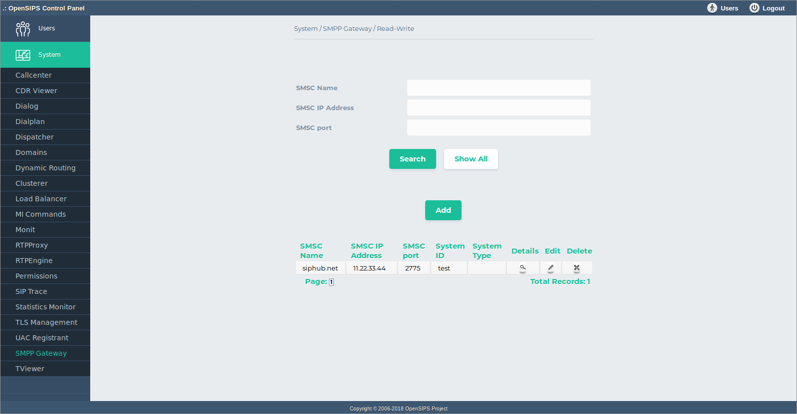
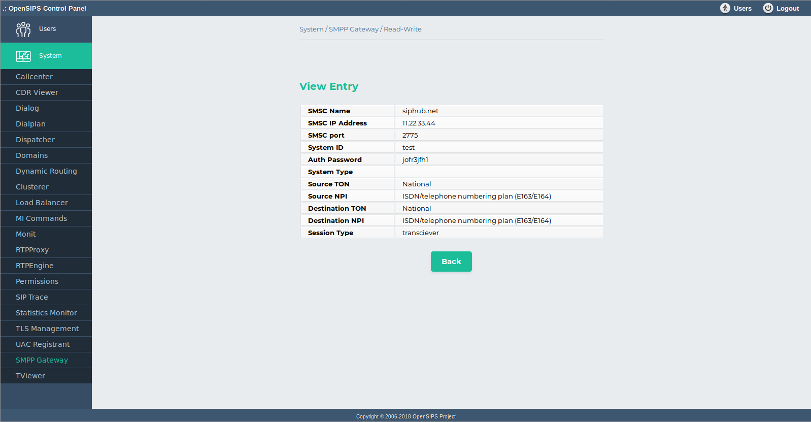

## Description

The SMPP Gateway OCP tool maps on the [Proto SMPP OpenSIPS module](https://docs.opensips.org/manual/3-3/modules/proto_smpp). It provides OpenSIPS the abilities to connect to multiple SMS Centers (via SMPP protocol) and to send and received SMS'es, by converting them from / to SIP MESSAGE requests - basically to perform the functionality of a bidirectional SIP to SMPP gateway

As the SMS Center records are kept in an SQL database, the tool provides standard DB provisioning operations : add, delete, search and listing of the records. As all the changes are done in database, to apply them into your OpenSIPS, you need to restart it.

## Configuration

Tool specific settings are configurable via the setting panel - see gear-icon in the tool header.

All settings are explained via ToolTip and have format validation.

## Screenshots

