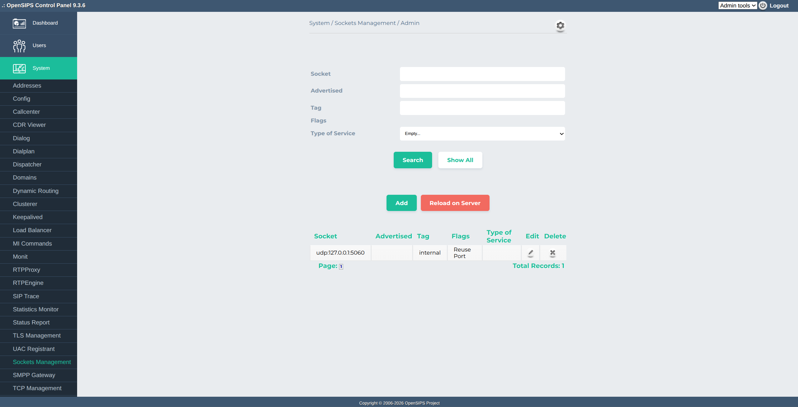

## Description

The **Sockets Management** tool allows provisioning and managing **dynamic SIP listeners** at runtime using the OpenSIPS `sockets_mgm` module. Socket definitions are stored in a database table and can be added, edited, or removed from the Control Panel.

> [!IMPORTANT]
> Changes in the database are applied to OpenSIPS only after triggering a sockets reload (via MI command sockets\_reload). The tool provides a Reload on Server action for this.

## Configuration

Tool specific settings are configurable via the setting panel - see gear-icon in the tool header.

All settings are explained via ToolTip and have format validation.

## Screenshots

