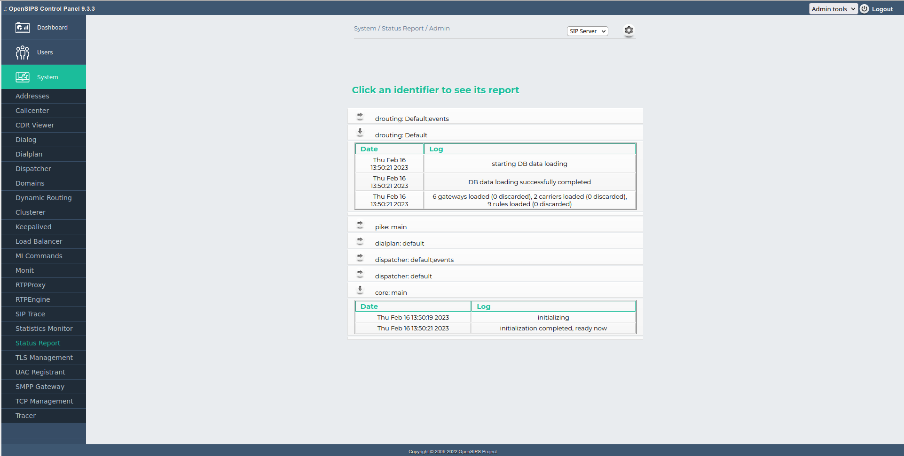

## Description

The Status-Report OCP tool maps on the [OpenSIPS Status/Report framework](https://docs.opensips.org/manual/3-3/interface-statusreport). It provides the the ability to featch and display the reports of the OpenSIPS SR's identifiers.

## Screenshots

