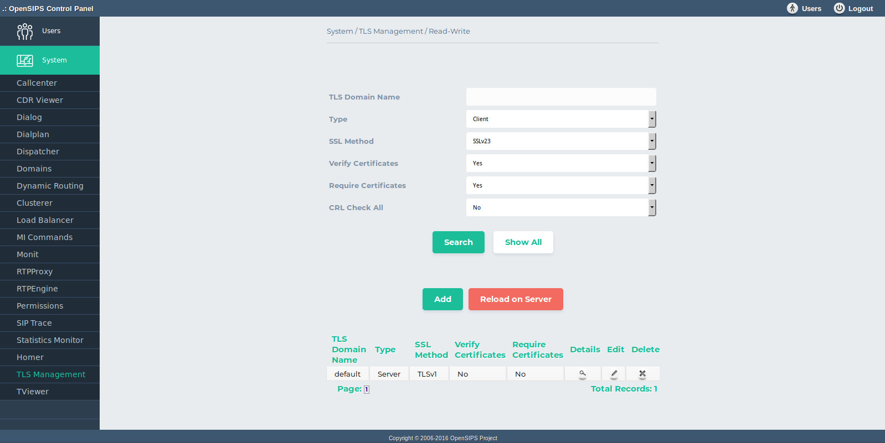
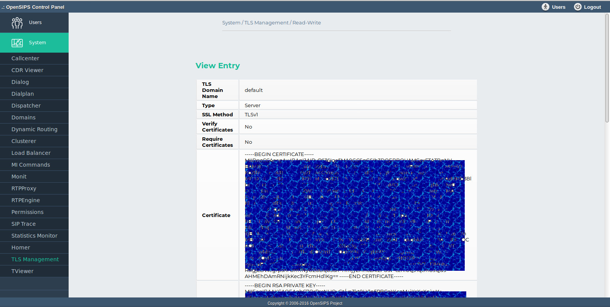

## Description

The TLS Management OCP tool maps on the [TLS MGM OpenSIPS module](https://docs.opensips.org/manual/2-4/modules/tls_mgm). It provides the abilities to provision all the TLS domains (certifications and usage settings/conditions) used in OpenSIPS by various other modules (TLS and WSS protocols, REST client module and MySQL backend).

As the TLS domains are kept in an SQL database, the tool provides standard DB provisioning operations : add, delete, search and listing of the TLS domains. As all the changes are done in database, to apply them into your OpenSIPS, you need to click on *Apply Changes to Server* button.

## Configuration

- Database layer configuration file : **opensips-cp/config/tools/system/tls\_mgm/db.inc.php** Attributes set in this file :
  - database host
  - database port
  - database username
  - database password
  - database name

## Screenshots

