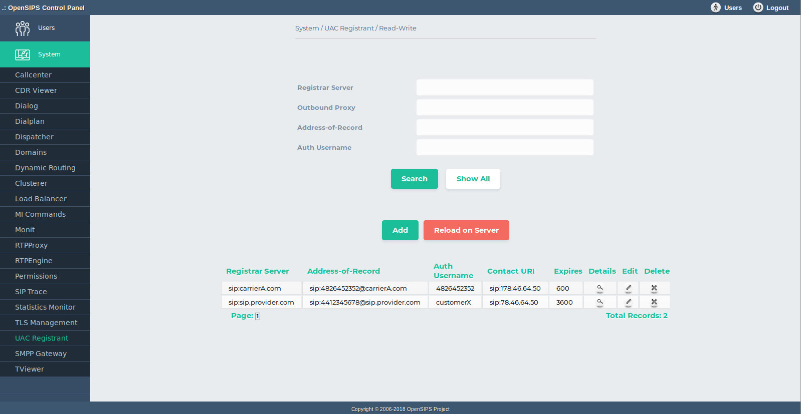
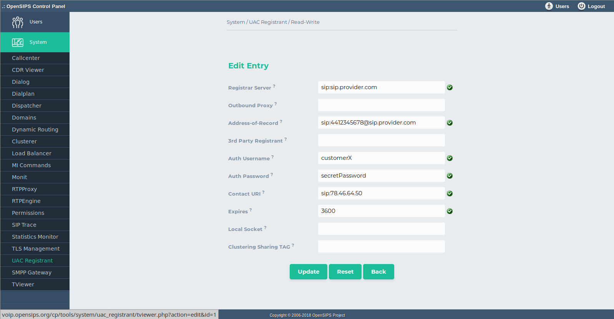

## Description

The UAC Registant OCP tool maps on the [UAC Registrant OpenSIPS module](https://docs.opensips.org/manual/3-3/modules/uac_registrant). It provides OpenSIPS the abilities to register itself, via SIP, to another remote SIP registrar (also with digest authentication support).

As the UAC registrant records are kept in an SQL database, the tool provides standard DB provisioning operations : add, delete, search and listing of the records. As all the changes are done in database, to apply them into your OpenSIPS, you need to click on *Reload on Server* button.

## Configuration

Tool specific settings are configurable via the setting panel - see gear-icon in the tool header.

All settings are explained via ToolTip and have format validation.

## Screenshots

