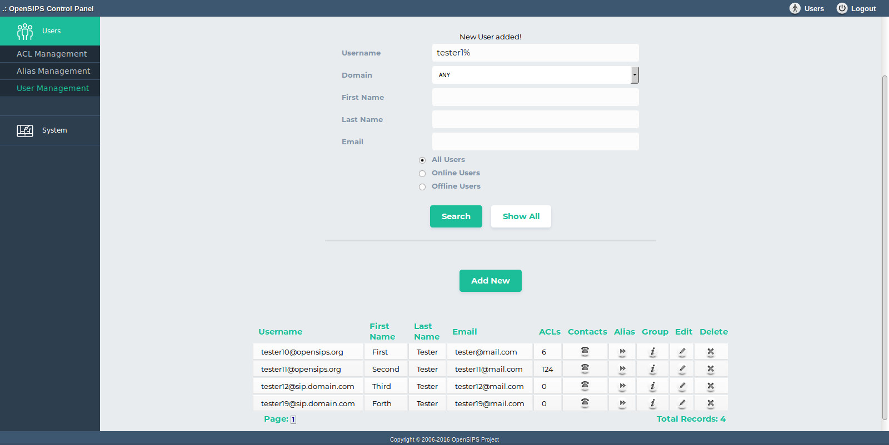

## Description

This tools allows adding new SIP users, listing (offline/online/all) the SIP users and changes to the SIP users' settings.

The User Management Tool is featured for OpenSIPS' user provisioning. There is the posibility of adding new user, deleting a user and also his alias, searching for a certainn user or showing the whole content of the subscriber table.

## Configuration

- Database layer configuration file : **opensips-cp/config/tools/users/user\_management/db.inc.php** Attributes set in this file :
  - database host
  - database port
  - database username
  - database password
  - database name
- Local configuration file : **opensips-cp/config/tools/users/user\_management/local.inc.php** Attributes set in this file :
  1. Attributes the controll the listing of SIP user records.
    ```
    // the number of results listed on a page
    $config->results_per_page = 10;
    // the number of pages per range 	
    $config->results_page_range = 10;
    ```
  2. Attributes that control the DB tables
    ```
    $config->table_users = "subscriber";
    $config->table_location = "location";
    $config->table_aliases = array("DBaliases"=>"dbaliases");
    ```
  3. Password mode: **$config->passwd\_mode.**
    1. This array controls the way the SIP user password is going to be saved in the database, by setting: $config->passwd\_mode=0 the password will be saved in a text mode, by setting:
    2. $config->passwd\_mode=1 the password will be saved in a chyphered way (password field will be empty and ha1 will be calculated)
  4. Extra fields in subscriber table **$config->subs\_extra** This option allow you to define extra fields in the subscriber table (other than the ones created by default by OpenSIPS) - these additional fields will be managed (added, displaied and modified) by the tool, for each user
    ```
    // Key is the column name, the value is the Display name
    $config->subs_extra = array();
    $config->subs_extra['first_name'] = "First Name" ;
    $config->subs_extra['last_name']  = "Last Name" ;
    ```

## Screenshots


