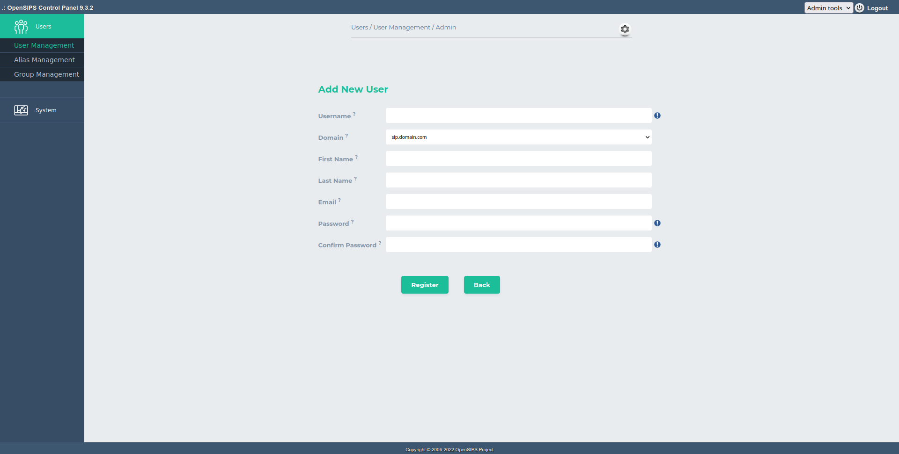

## Description

This tools allows adding new SIP users, listing (offline/online/all) the SIP users and changes to the SIP users' settings.

The User Management Tool is featured for OpenSIPS' user provisioning. There is the posibility of adding new user, deleting a user and also his alias, searching for a certainn user or showing the whole content of the subscriber table.

Via the tool configuration, it is possible to customize the user profile by adding new columns to the subscriber table.

This tool maps over the [*auth\_db* module](https://docs.opensips.org/manual/3-3/modules/auth_db) from OpenSIPS.

## Configuration

Tool specific settings are configurable via the setting panel - see gear-icon in the tool header.

All settings are explained via ToolTip and have format validation.

## Screenshots

